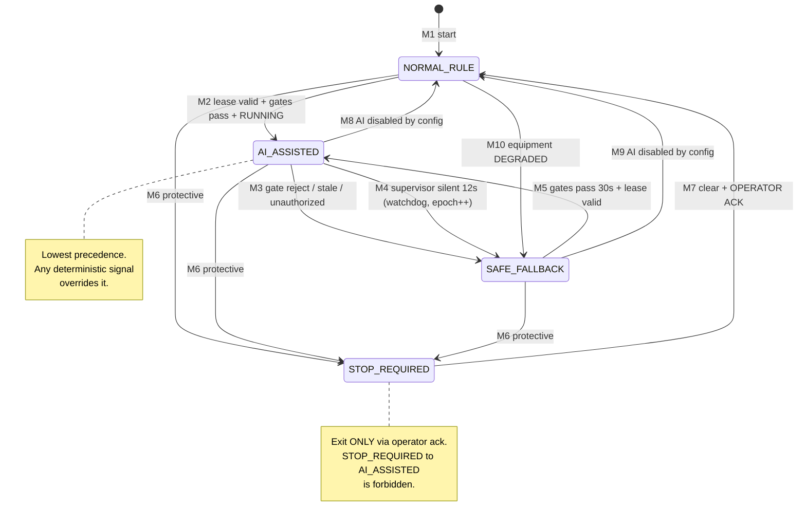

# Control Mode State Machine

> Closes: GAP-024 (mode state machine), GAP-035 (`STOP_REQUIRED` trigger), and the mode-ownership
> finding Codex raised in Round 1.
> Depends on: DEC-001 (three-layer authority, control epoch), DEC-004 (manual mode deleted from
> baseline).
> Status: v0.3 normative.

## 1. What a control mode is, and who owns it

A **control mode** is the answer to one question: *what is currently permitted to determine the
equipment setpoint?* It is per-equipment, not global.

**Single owner: the Control Service.** This is the change from v0.2, where mode was implicitly a
property of the Safety Supervisor. Mode must be owned by the component that still exists when the
Supervisor dies (DEC-001), otherwise the mode is undefined in exactly the situation it matters most.

| Concern | Owner |
|---|---|
| **Authoritative mode value** | Control Service (durable, per equipment) |
| Mode *requests* | Safety Supervisor |
| Mode *forcing* on protective trip | Equipment (L3) → observed, then reflected |
| Mode display | Operations Service / Dashboard (read-only) |

The Supervisor may **request** `AI_ASSISTED`; only the Control Service **grants** it. The Supervisor
can never place itself in authority.

## 2. Modes

v0.2 defined four. v0.3 keeps exactly those four — `MANUAL_OPERATOR` was considered and
**deliberately rejected** in DEC-004 to avoid a documented-but-unimplemented bypass.

| Mode | Setpoint determined by | Entry authority | AI influence |
|---|---|---|---|
| `NORMAL_RULE` | deterministic rule/config baseline | default at startup | none |
| `AI_ASSISTED` | Supervisor-accepted bounded AI recommendation | Control Service grants on Supervisor request | bounded |
| `SAFE_FALLBACK` | fixed configured fallback rate (60 %) | Control Service (autonomous) or Supervisor | none |
| `STOP_REQUIRED` | forced 0 % | Equipment protective trip, or Supervisor on protective condition | none |

### Why `NORMAL_RULE` and `SAFE_FALLBACK` are distinct
Both are non-AI, which invites merging them. They are kept separate because they mean different
things operationally: `NORMAL_RULE` is "AI is not in use and nothing is wrong"; `SAFE_FALLBACK` is
"AI *should* be in use but is not trustworthy right now." Collapsing them would make it impossible
to distinguish a healthy non-AI baseline from an active AI degradation, and `fallback_active` is a
required metric (`OBSERVABILITY_AND_SLO.md`).

## 3. Transition table

| # | From | To | Trigger | Authority | Operator ack | Notes |
|---|---|---|---|---|---|---|
| M1 | *(start)* | `NORMAL_RULE` | service start | Control Service | no | always the startup mode |
| M2 | `NORMAL_RULE` | `AI_ASSISTED` | Supervisor holds a valid lease **and** all gates pass **and** equipment is `RUNNING` | Control Service grants | no | |
| M3 | `AI_ASSISTED` | `SAFE_FALLBACK` | any gate rejects, or prediction/telemetry stale, or model unauthorized | Supervisor requests | no | the normal AI-rejection path |
| M4 | `AI_ASSISTED` | `SAFE_FALLBACK` | Supervisor silent > `supervisor_silence_timeout` (12 s) | **Control Service autonomous** | no | watchdog; increments `controlEpoch` |
| M5 | `SAFE_FALLBACK` | `AI_ASSISTED` | gates pass continuously for `fallback_recovery_hold` (30 s) **and** lease valid | Control Service grants | no | hold prevents flapping |
| M6 | any | `STOP_REQUIRED` | equipment protective condition, or Supervisor protective request | Equipment (L3) or Supervisor | no | forced, immediate |
| M7 | `STOP_REQUIRED` | `NORMAL_RULE` | all protective conditions clear **and** operator reset | **operator** | **YES** | only operator-gated transition |
| M8 | `AI_ASSISTED` | `NORMAL_RULE` | AI disabled by configuration | operator/config | no | planned AI-out-of-service |
| M9 | `SAFE_FALLBACK` | `NORMAL_RULE` | AI disabled by configuration | operator/config | no | |
| M10 | `NORMAL_RULE` | `SAFE_FALLBACK` | equipment enters `DEGRADED` | Control Service | no | conservative on degradation |

### Forbidden transitions
- **`STOP_REQUIRED` → `AI_ASSISTED`** directly. Always via `NORMAL_RULE` with operator
  acknowledgement (M7). AI must never be the thing that releases a stop.
- **`SAFE_FALLBACK` → `AI_ASSISTED`** without the 30 s hold (M5). Instant recovery would flap.
- Any transition into `AI_ASSISTED` while equipment state ≠ `RUNNING`
  (`EQUIPMENT_MODEL_AND_STATE.md` §3.1).
- Any transition **requested by the Supervisor** that *raises* its own authority without Control
  Service grant.

## 4. Mode precedence

When two triggers fire in the same evaluation cycle, the **most restrictive wins**:

```text
STOP_REQUIRED  >  SAFE_FALLBACK  >  NORMAL_RULE  >  AI_ASSISTED
```

`AI_ASSISTED` is least privileged in precedence terms, which is the correct reading: it is the only
mode where a probabilistic component influences the setpoint, so any competing deterministic signal
must override it. This resolves the race Codex raised in Round 1 where a delayed AI command could
contend with a watchdog fallback — precedence plus the `controlEpoch` fence make the outcome
deterministic rather than arrival-order dependent.

## 5. `STOP_REQUIRED` entry conditions (GAP-035)

v0.2 said fallback "**may** escalate" with no trigger. These are now deterministic. Any one suffices:

1. an equipment protective condition latches (`EQUIPMENT_MODEL_AND_STATE.md` §3.4);
2. `quality.overall = BAD` on a safety-required sensor for > 5 s while equipment is `RUNNING`;
3. equipment reaches `FAULT`;
4. commanded/applied divergence > 25 pp for > 10 s (the drive is not obeying);
5. operator request.

Exit is **only** M7: conditions clear **and** explicit operator acknowledgement. There is no
timeout-based auto-exit from `STOP_REQUIRED` — a stop that clears itself is not a stop.

> Scope note, per MASTER_SPEC §2: `STOP_REQUIRED` is a **simulator-level demonstration** of a
> rule-driven stop. It is not a certified safety function and must never be described as one.

## 6. Diagram



## 7. Mode persistence and restart recovery

| Question | Rule |
|---|---|
| Where is mode stored? | PostgreSQL, owned by Control Service, written before the corresponding equipment write |
| Control Service restart | reload persisted mode; **`AI_ASSISTED` is never restored** — it downgrades to `SAFE_FALLBACK` and must be re-earned via M5 |
| `STOP_REQUIRED` restart | **preserved across restart**; a stop must survive a crash or it is not a stop |
| Mode unreadable at startup | fail closed to `SAFE_FALLBACK`; if the equipment was in `STOP_REQUIRED`, fail closed to `STOP_REQUIRED` |
| Supervisor restart | mode unaffected — the Supervisor does not own it |

`AI_ASSISTED` never being restored is deliberate: after a Control Service restart, the epoch has
changed, no Supervisor lease is valid, and the freshness of every input is unknown. Re-earning AI
authority costs at most 30 s and removes an entire class of restart races.

## 8. Every mode change is an audited event

Each transition emits to `factory.control-outcomes.v1` and the audit store:

`equipmentId, fromMode, toMode, transitionId (M1..M10), triggerReasonCode, controlEpoch,
authenticatedSource, decisionId?, occurredAtUtc, operatorId?, correlationId`

`operatorId` is required and non-null for M7. A `STOP_REQUIRED` release with no recorded operator
is a contract violation and must fail rather than default.
