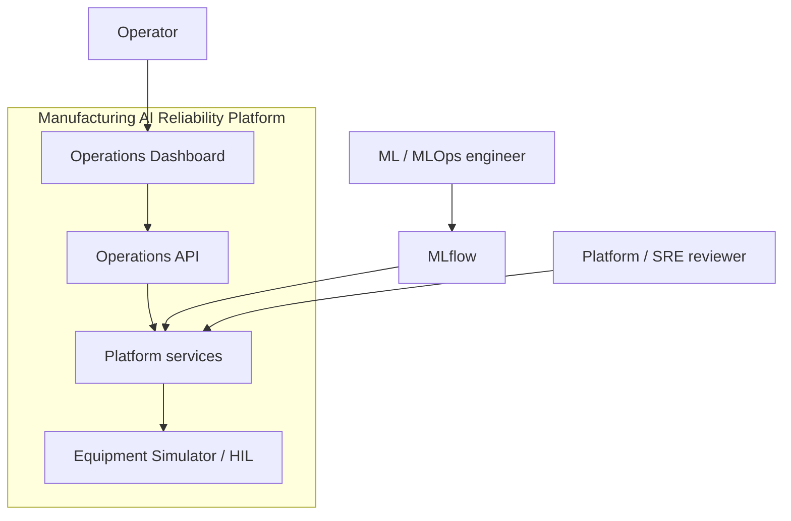
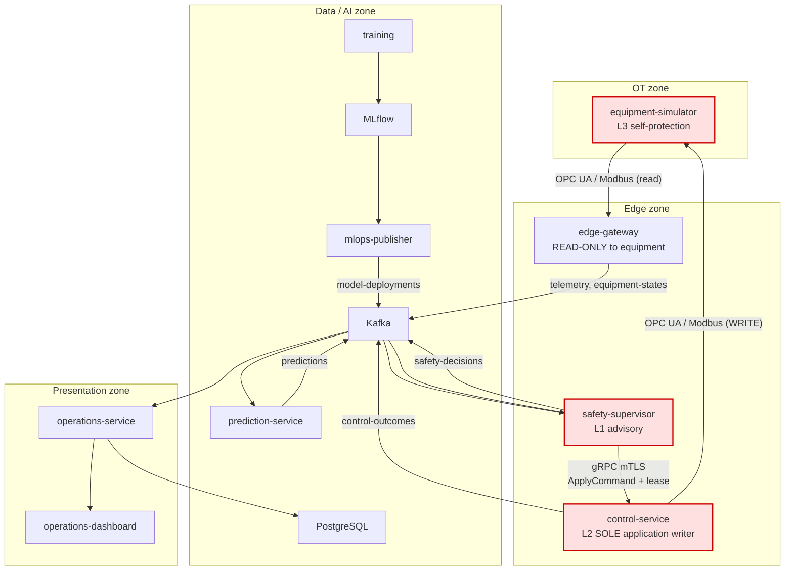
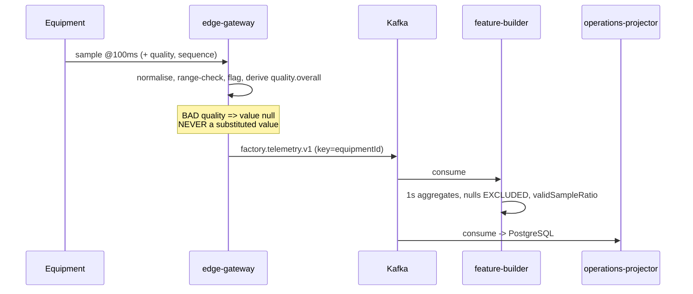
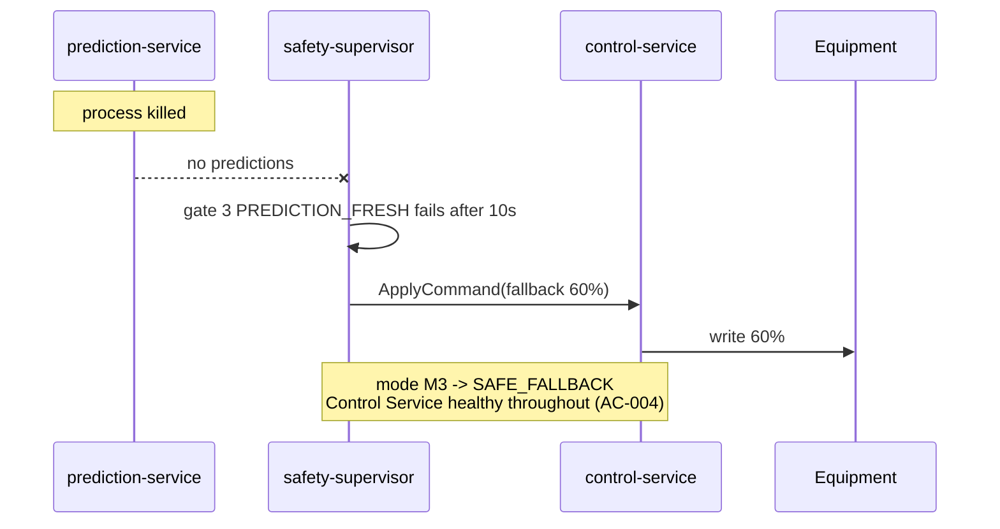
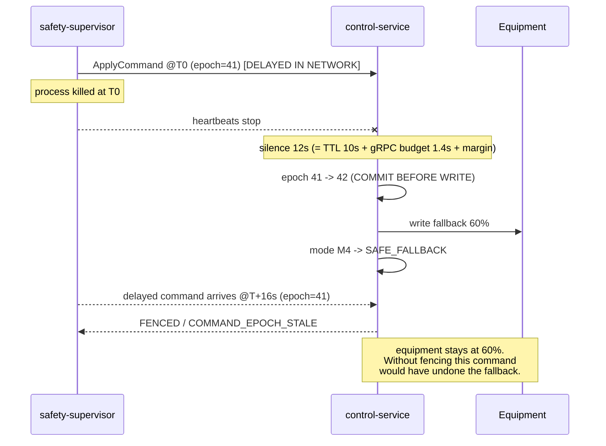
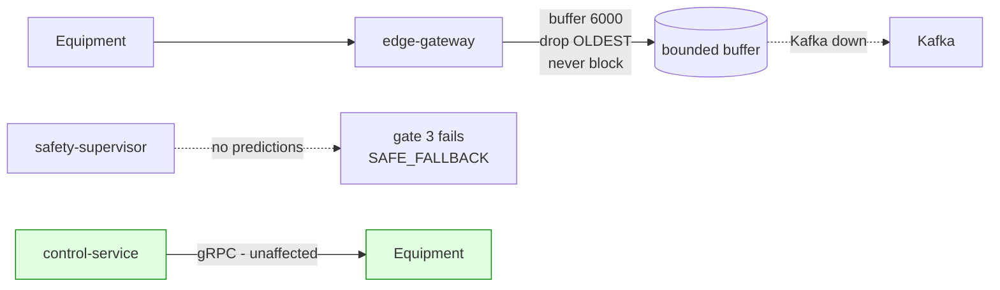
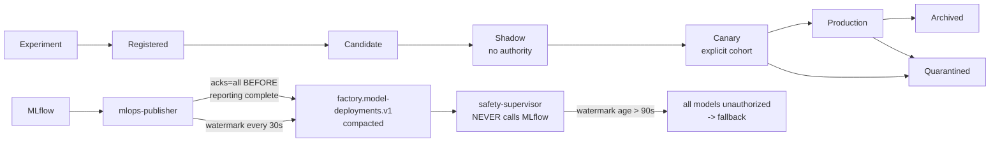
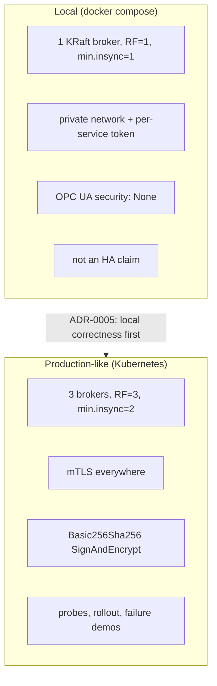
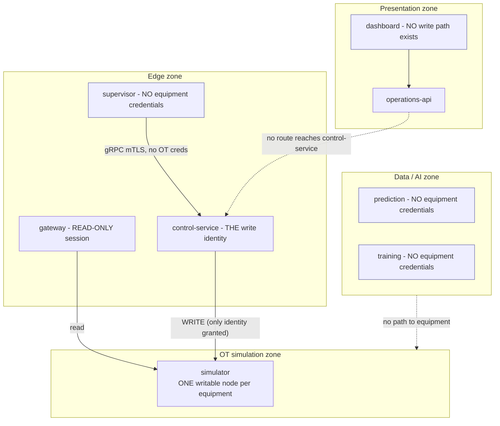

# Architecture Diagrams

> Closes GAP-095. All diagrams are Mermaid and must agree with the contracts and written
> architecture; a diagram that disagrees with a contract is a defect in the diagram.
> The equipment and control-mode state machines live with their transition tables in
> `EQUIPMENT_MODEL_AND_STATE.md` §3.5 and `CONTROL_MODE_STATE_MACHINE.md` §6 and are not duplicated
> here — two copies of a state machine is the same defect as two copies of a gate list.

## 1. System context



## 2. Service architecture with authority layers



**The command path is the only red edge that writes.** Note that Kafka never appears on it — that is
ADR-0009 made visual.

## 3. Telemetry flow



## 4. Prediction → safety → control (happy path)

```mermaid
sequenceDiagram
    participant PRED as prediction-service
    participant K as Kafka
    participant SUP as safety-supervisor
    participant CTL as control-service
    participant EQ as Equipment

    PRED->>K: prediction (stage, featureSchemaVersion, validSampleRatio)
    K->>SUP: consume
    SUP->>SUP: 13 gates in order; record ALL results
    SUP->>K: safety-decision (ACCEPT + RATE_CHANGE_CLAMPED)
    SUP->>CTL: ApplyCommand(controlEpoch, expires=+2s)
    CTL->>CTL: verify mTLS identity -> authenticatedSource
    CTL->>CTL: epoch check, expiry, supersession, bounds, budget
    CTL->>EQ: write setpoint
    EQ-->>CTL: ack
    CTL->>K: control-outcome (APPLIED)
```

## 5. AI failure → fallback



## 6. Supervisor failure → watchdog → epoch fencing



This is the race Codex found in Round 1; the diagram exists because it is the single most important
interaction in the platform.

## 7. Kafka failure



**Kafka is CONTROL-INDEPENDENT (F06).** The OT poll loop never blocks, because blocking it would make
the analytics backbone a dependency of the control-adjacent path.

## 8. Model lifecycle and authorization



## 9. Local vs production-like deployment



## 10. Trust boundaries



The dotted edges are the important ones: they are paths that **must not exist**, and each is asserted
by a test (AC-037, AC-039).
