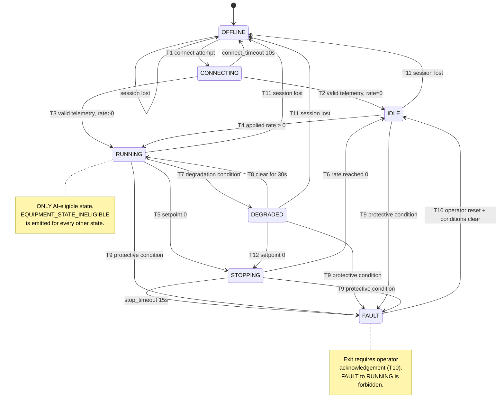

# Equipment Model and State Machine

> Closes: GAP-023 (equipment state machine), GAP-044 (simulator dynamics).
> Status: v0.3 normative for the **simulated** equipment profile.

## 0. Status of the numbers in this document

Every constant here is a **simulator design constant**. It defines the behaviour of the Digital
Twin/HIL model that this project ships. It is **not** a measurement of, or a claim about, any real
industrial machine, and must never be presented as a real-world safety limit. The values are chosen
to be physically plausible and internally consistent so that degradation, fault, and control
scenarios are reproducible and testable.

Where a value genuinely requires future evidence (a tuning outcome, a measured latency) it is marked
`TBD-WITH-DECISION` rather than guessed.

---

## 1. Modelled equipment

A **variable-speed motor-driven conveyor drive unit** (ADR-0004, `RUNTIME_BEHAVIOR.md`).
One equipment instance = one motor + drive + bearing assembly + conveyor load.

### 1.1 Control input

| Input | Symbol | Unit | Range | Notes |
|---|---|---|---|---|
| Operation rate setpoint | `r_sp` | % | 0–100 | The only writable control value. `SET_OPERATION_RATE`. |

### 1.2 Sensor channels

All seven channels are published on every telemetry event (`contracts/jsonschema/v1/telemetry.schema.json`).

| Channel | Unit | Nominal @ r=100% | Valid range | Resolution | Sensor fault modes |
|---|---|---|---|---|---|
| `rpm` | rpm | 1800.0 | 0 – 2200 | 0.1 | drift, freeze, dropout |
| `torqueNm` | N·m | 42.0 | −10 – 150 | 0.1 | drift, noise |
| `currentA` | A | 12.0 | 0 – 40 | 0.01 | drift, noise, dropout |
| `voltageV` | V | 400.0 | 0 – 480 | 0.1 | sag, noise |
| `temperatureC` | °C | 48.0 | −20 – 160 | 0.1 | drift, freeze, dropout |
| `vibrationRms` | mm/s | 2.2 | 0 – 50 | 0.01 | drift, noise, dropout |
| `operationRatePct` | % | 100.0 | 0 – 100 | 0.1 | echo of applied setpoint |

`operationRatePct` is the **applied** rate as the equipment reports it, which is not necessarily the
last commanded rate — the difference is what makes command-confirmation observable (DEC-003,
GAP-034).

### 1.3 Nominal relationships

Let `r ∈ [0,1]` be the applied operation rate fraction, `h ∈ [0,1]` bearing health loss
(`0` = healthy), and `c ∈ [0,1]` cooling degradation (`0` = nominal cooling).

```text
rpm            = 1800 · r                                    ± N(0, 1.5)
torqueNm       = 42 · r · (1 + 0.45·h)                       ± N(0, 0.4)
currentA       = 12 · r · (1 + 0.55·h)                       ± N(0, 0.06)
voltageV       = 400                                         ± N(0, 1.2)
vibrationRms   = 2.2 · (0.35 + 0.65·r) · (1 + 12.0·h²)       ± N(0, 0.05)
temperatureC   → first-order lag toward T_target (below)
```

The bearing-health coupling on `vibrationRms` was **6.0 until 2026-09-15**. It was raised to 12.0
when OD-002 was resolved: at 6.0 a completely failed bearing (`h = 1`) produced 15.4 mm/s, which is
below the 25.0 mm/s protective limit in §3.4, so **no fault the simulator could generate was able to
trip the over-vibration protection**. At 12.0 the worst case is 28.6 mm/s, the `DEGRADED` threshold
(12 mm/s) is crossed at `h ≈ 0.61` and the protective limit at `h ≈ 0.95`, so the two stages stay
distinguishable. The protective limit itself was deliberately **not** lowered — see OD-002.

Temperature is the only channel with memory:

```text
T_target = T_ambient + 32·r·(1 + 0.8·h) / (1 − 0.75·c)
T[k+1]   = T[k] + (T_target − T[k]) · (Δt / τ_thermal)
T_ambient   = 22.0 °C
τ_thermal   = 180 s
Δt          = 0.1 s   (telemetry cadence)
```

This gives a thermally realistic ~3-minute response, so an overheat fault develops on a timescale a
human can observe in a demo and an RUL model can actually learn.

**Physical floor on additive noise** (added 2026-09-15 during Phase 1 implementation). The additive
Gaussian terms above are clamped at a channel's lower bound wherever that bound is a physical floor
— `rpm`, `currentA`, `vibrationRms`, `voltageV`, and `operationRatePct` at 0. Without the clamp a
channel resting at zero produces negative readings; `currentA` is **safety-required**, so a negative
reading is `VALUE_OUT_OF_RANGE` → `BAD` → a protective trip within 2 s, and an *idle* machine would
fault itself while doing nothing. Only the **lower** bound is clamped: an upper excursion is a real
condition and must stay visible as `VALUE_OUT_OF_RANGE`.

### 1.4 Rate-limited actuation

The drive does not jump to a new setpoint. Applied rate slews:

```text
max_slew = 15 %/s
r_applied[k+1] = r_applied[k] + clamp(r_sp − r_applied[k], −max_slew·Δt, +max_slew·Δt)
```

Consequence, which the Safety Supervisor must tolerate: after an accepted command there is a
**bounded convergence window** (worst case 100→60 % takes ≈ 2.7 s) during which
`operationRatePct` does not equal the commanded value. Command confirmation must therefore be
evaluated with a tolerance band and a deadline, not by exact equality
(see `docs/11-service-design/CONTROL_SERVICE.md`).

---

## 2. Degradation and fault profiles

Each profile is deterministic given a seed, satisfying NFR-010 and FR-002.

| Profile ID | Requirement | Drives | Model |
|---|---|---|---|
| `NORMAL` | FR-002 | — | `h=0`, `c=0`, sensor noise only |
| `BEARING_DEGRADATION` | FR-002, AC-005 | `h` | `h(t) = min(1, (t/T_fail)^2.2)`, `T_fail` configurable, demo default 1800 s |
| `OVERLOAD` | FR-002 | torque, current | load factor ×**2.8** applied to torque and current |
| `COOLING_DEGRADATION` | FR-002 | `c` | `c(t) = min(**0.95**, t/T_cool)`, demo default `T_cool` 900 s |
| `SENSOR_DRIFT` | FR-002 | one channel | additive ramp, default +0.02 · range per 60 s |
| `SENSOR_NOISE` | FR-002 | one channel | noise σ multiplied ×8 |
| `SENSOR_FREEZE` | FR-002 | one channel | value held constant → `SENSOR_FROZEN` flag |
| `SENSOR_DROPOUT` | FR-002 | one channel | value becomes `null` → `SENSOR_MISSING` flag (DEC-008) |
| `COMM_LOSS` | FR-002, AC-002 | transport | protocol endpoint stops responding |
| `OOD_PROFILE` | FR-002, AC-005 | all | operating point moved outside the training envelope: `rpm` held at 1800 while `r` is commanded to 60 %, breaking the learned rpm↔rate relationship |
| `DRIVE_STUCK` | FR-002, AC-018 | actuation | the drive stops following its setpoint: `r_applied` freezes at its value at `T_stuck` and ignores every later command. Demo default `T_stuck` 60 s. Added 2026-09-15 by OD-001 |

`OOD_PROFILE` is deliberately defined as a **relationship** violation rather than an out-of-range
value, because a simple range check would otherwise catch it and the OOD gate would never be
exercised.

`DRIVE_STUCK` exists for the same class of reason. §3.3 makes "the drive is not tracking its
setpoint" a degradation condition, but until OD-001 was resolved **no profile could cause it**, so
`T7` had a trigger that nothing in the model could pull. The profile gives it a cause. It is also
the failure the three-layer authority model exists for: equipment that stops obeying the platform.

### 2.2 Why the severities changed on 2026-09-15 (OD-002)

`OVERLOAD` was ×1.6 and `COOLING_DEGRADATION` capped `c` at 0.9. Neither could reach its protective
limit: ×1.6 produced 19.2 A against a 32 A trip, and `c = 0.9` produced a `T_target` of 120.46 °C
against a 120 °C trip — a 0.46 °C margin that took ~20 minutes to cross. Together with the vibration
coupling above, **two of the three sensed protective conditions were unreachable and the third was
marginal**, which made the innermost safety layer unexercisable by any scenario the demo runs.

The resolution moves **fault severity**, not the safety limits. A simulator that cannot produce a
dangerous machine is a limitation of the fault model; it is not evidence that 25 mm/s or 32 A is the
wrong limit, and lowering the limits would have compressed the `DEGRADED` → `FAULT` ladder that
`T7`/`T8`/`T9` depend on.

| Constant | Was | Now | Worst case now | Protective limit |
|---|---|---|---|---|
| vibration coupling `k` in `(1 + k·h²)` | 6.0 | **12.0** | 28.6 mm/s | 25.0 |
| `OVERLOAD` load factor | ×1.6 | **×2.8** | 33.6 A | 32 |
| `COOLING_DEGRADATION` cap on `c` | 0.9 | **0.95** | 133.3 °C | 120 |

Ranges still hold: 33.6 A < 40 A, 117.6 N·m < 150 N·m, 133.3 °C < 160 °C, 28.6 mm/s < 50 mm/s.

### 2.1 Bearing degradation is the RUL label source

Ground-truth RUL for training is `T_fail − t` while `BEARING_DEGRADATION` is active. This is the
only place ground truth exists, which is why `T_fail` must be recorded in the dataset metadata
(FR-040).

---

## 3. Equipment state machine

**Owner:** `equipment-simulator` owns the physical state. `edge-gateway` owns the *observed*
connectivity state. The two are distinct and must not be conflated — a gateway that cannot reach a
healthy machine reports `OFFLINE` while the machine is in fact `RUNNING`.

The state published on `factory.equipment-states.v1` is the **gateway-observed** state, and it
carries an `observedBy` field so a consumer can never mistake it for ground truth.

### 3.1 States

> **"Session" here means a protocol connection, and nothing about authorization.** OPC UA has
> sessions in the protocol sense; **Modbus TCP does not** — it has a TCP connection carrying no
> identity. The states below and `session_timeout` in `T11` describe *connectivity*, which both
> protocols have. Who may write is a separate matter entirely and is answered per protocol in
> `OT_PROTOCOL_MAPPING.md` §3 and `SECURITY_BOUNDARIES.md` (OD-003). Conflating the two is the
> mistake that produced OD-003 in the first place.

| State | Meaning | Rate setpoint accepted? | AI eligible? |
|---|---|---|---|
| `OFFLINE` | No protocol session. | No | No |
| `CONNECTING` | Session being established, no valid telemetry yet. | No | No |
| `IDLE` | Connected, healthy, rate = 0. | Yes | No (no operating point to optimise) |
| `RUNNING` | Connected, healthy, rate > 0. | Yes | **Yes** |
| `DEGRADED` | Connected, operating, but one or more quality/health conditions active. | Yes | No |
| `FAULT` | Protective condition latched. Rate forced to 0. | No | No |
| `STOPPING` | Commanded to 0, slewing down, not yet at rest. | No | No |

`RUNNING` is the **only** AI-eligible state. This is the concrete definition that
`EQUIPMENT_STATE_INELIGIBLE` (GAP-023) was missing.

### 3.2 Transition table

| # | From | To | Trigger | Automatic? | Timeout | Safety consequence |
|---|---|---|---|---|---|---|
| T1 | `OFFLINE` | `CONNECTING` | connect attempt | auto | — | none |
| T2 | `CONNECTING` | `IDLE` | first valid telemetry, rate = 0 | auto | `connect_timeout` 10 s → back to `OFFLINE` | none |
| T3 | `CONNECTING` | `RUNNING` | first valid telemetry, rate > 0 | auto | as T2 | none |
| T4 | `IDLE` | `RUNNING` | applied rate > 0 | auto | — | AI becomes eligible |
| T5 | `RUNNING` | `STOPPING` | setpoint 0 commanded | auto | — | AI authority ends immediately |
| T6 | `STOPPING` | `IDLE` | applied rate reaches 0 | auto | `stop_timeout` 15 s → `FAULT` | none |
| T7 | `RUNNING` | `DEGRADED` | any degradation condition (§3.3) | auto | — | **AI authority suspended** |
| T8 | `DEGRADED` | `RUNNING` | all degradation conditions clear for `degraded_clear_hold` 30 s | auto | — | AI authority restored |
| T9 | `RUNNING`/`DEGRADED`/`IDLE`/`STOPPING` | `FAULT` | any protective condition (§3.4) | auto | — | rate forced 0, AI suspended |
| T10 | `FAULT` | `IDLE` | operator reset **and** all protective conditions clear | **operator** | — | requires explicit acknowledgement |
| T11 | any | `OFFLINE` | protocol session lost | auto | `session_timeout` 3 s | telemetry becomes stale; Supervisor rejects on freshness |
| T12 | `DEGRADED` | `STOPPING` | setpoint 0 commanded | auto | — | none |

**Forbidden transitions**, stated explicitly because their absence is what makes the machine safe:
- `FAULT → RUNNING` directly. `FAULT` always exits through `IDLE` with operator acknowledgement (T10).
- `OFFLINE → RUNNING` directly. Connectivity must be re-established through `CONNECTING` (T1–T3).
- Any transition **into** `RUNNING` that is triggered by an AI recommendation. AI can only modulate
  the rate **within** `RUNNING`; it can never start a machine.

`T8`'s 30 s hold is anti-flapping: without it a marginal sensor oscillating around a threshold would
flip AI authority on and off every telemetry tick.

### 3.3 Degradation conditions (`RUNNING → DEGRADED`)

Any one is sufficient:
- `quality.overall = UNCERTAIN` sustained for > 2 s;
- any **safety-required** sensor carrying an UNCERTAIN-contributing flag;
- `vibrationRms` > 12.0 mm/s;
- `temperatureC` > 95 °C;
- observed `operationRatePct` deviates from the **slew-limited expected rate** by > 10 pp for
  > `slew_grace` 5 s (i.e. the drive is not tracking its setpoint). *Clarified 2026-09-15:* the
  comparison is against the expected rate, not the raw commanded value. A legitimate full-range
  change takes 6.7 s at 15 %/s (§1.4), so comparing against the command would put **every cold
  start** into `DEGRADED` and hold it there through the 30 s `T8` window — which contradicts `T4`,
  where `IDLE → RUNNING` is the normal start path. The parenthetical above is the governing
  intent: a drive that keeps pace with its own slew limit *is* tracking.

### 3.4 Protective conditions (`→ FAULT`)

Any one is sufficient:
- `temperatureC` > 120 °C;
- `vibrationRms` > 25.0 mm/s;
- `currentA` > 32 A sustained for > 1 s;
- `quality.overall = BAD` on a safety-required sensor sustained for > 2 s;
- explicit `STOP_REQUIRED` control mode entered.

`STOPPING` was added to `T9`'s source states on 2026-09-15, during Phase 1 verification. §3.4 says
any protective condition is sufficient for `→ FAULT`, but `T9`'s table omitted `STOPPING`, so a
machine slewing down through an over-temperature condition would have reached `IDLE` without ever
latching, escaping the operator-acknowledgement requirement whenever the condition cleared before
the drive came to rest. The prose was right and the table was wrong.

These are **simulator protective conditions**, enforced by the simulated equipment itself. They are
deliberately independent of the Safety Supervisor: this is the third, innermost layer of the defence
described in DEC-001, and it is the only layer that still functions if the entire platform is down.

### 3.5 Diagram



---

## 4. Safety-required vs advisory sensors

This mapping closes GAP-064 (`FEATURE_INCOMPLETE` was undecidable) and is the input to
`quality.overall` derivation (DEC-008).

| Channel | Safety-required | Used by gate | Rationale |
|---|---|---|---|
| `vibrationRms` | **yes** | quality, OOD, feature completeness | primary bearing-degradation signal |
| `temperatureC` | **yes** | quality, protective | primary thermal signal |
| `currentA` | **yes** | quality, OOD | load and degradation proxy |
| `rpm` | **yes** | OOD (rate↔rpm relationship) | required to detect `OOD_PROFILE` |
| `operationRatePct` | **yes** | command tracking confirmation | required to detect that the drive is not obeying its setpoint (T7). **Not** the rate-of-change baseline - that is the last accepted *commanded* value. |
| `torqueNm` | no | model feature only | advisory; degrades to `UNCERTAIN` |
| `voltageV` | no | model feature only | advisory; degrades to `UNCERTAIN` |

If any **safety-required** channel is `null` or carries a disqualifying quality flag,
`quality.overall = BAD` and the Safety Supervisor rejects with `SENSOR_QUALITY_BAD` or
`FEATURE_INCOMPLETE`. If only **advisory** channels are affected, `quality.overall = UNCERTAIN`, the
equipment moves to `DEGRADED` (T7), and AI authority is suspended without a hard reject.
